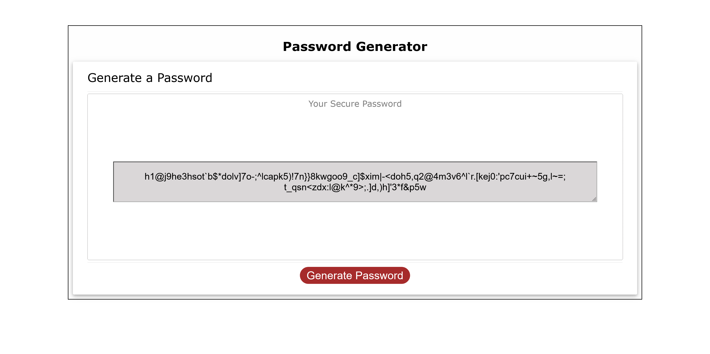
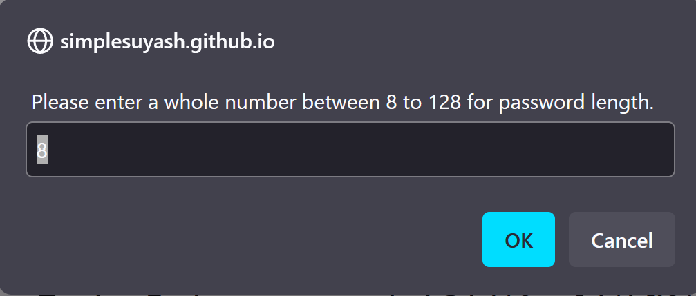
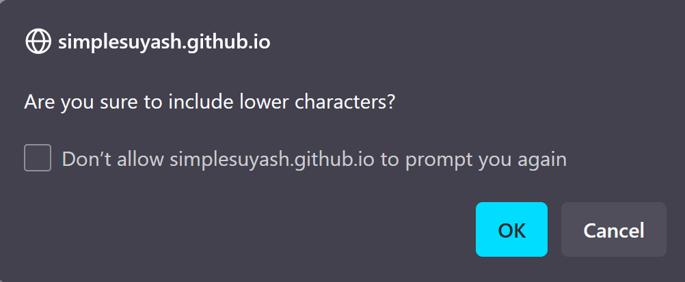
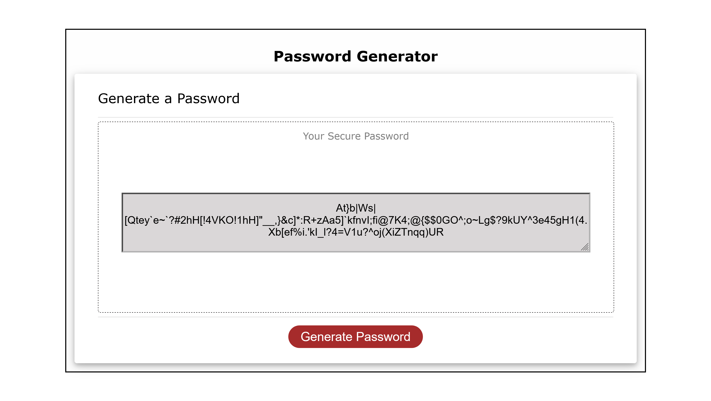
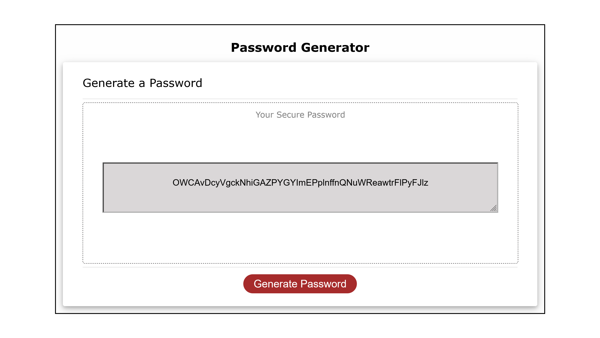

#Random Password Generator

##Description

The Random Password Generator generates a new random password everytime a user press a Generate Password button. This program is a very simple and unsophiticated where all the user inputs are collected through 'Confirm' and 'Prompt' boxes when a user click 'Generate Password' button.. It uses **HTML, CSS and JavaScript** only. This program was created as a part of assignment while doing a bootcamp at Sydney University, NSW as to have my HTML, CSS, JavaScript skill assessed.

All the code written in the program is mine, however, the 'normalize.css' is from the following source:  
 http://meyerweb.com/eric/tools/css/reset/
 
 v2.0 | 20110126
 
 License: none (public domain)
 

##How to use

Copy the repository in your local machine. Then simply open the 'index.html' page. It opens a very simple for with a button to generate password and a textarea to display the generated password. The user input is disabled for the textarea.

Firstly, when the button is pressed, the program will ask for the desired number of characters for a new random password. The criteria for the length of password being 8 characters minimum and 128 characters maximum. It informs this criteria to the users through those prompt/confirm boxes when asking for the user input. The user input for the length of the password is validated against several criteria. 
-If the input is not a number
-a whole number or not
-less that 8 
-greater that 128
-empty value
If the value entered does not match the criteria, it will ask for the value again through those prompt/confirm dialog boxes. However, if the user press the "Cancel" but this time, the whole program will terminate without any response. Whenever a user want to generate a password again, the 'Generate Password' button has to be pressed again. 

  

To include or not the lowercase characters, uppercase characters, numbers and special characters, users are asked for the input through the 'Confirm' dialog boxes. Pressing 'Ok' means to include the type, whereas pressing 'Cancel' means to not include the type.

When all the user input are correct and collected, the program displays the randomly generated password in a textarea inside a form. 

If you wish to make the program more user friendly and sophisticated, the user inputs should be collected through other more appropriate html element, such as range slider for password length, checkboxes for character types etc.

For sake of learning, the list of uppercase, lowercase alphabets, numbers and special characters are each populated/created through different methods such as Array spread, map etc. Array spread method would have been suffice, otherwise.

##Screenshot   
Screenshot showing password that including all charcters
---

Screenshot showing a password with lower and uppercase characters that is 50 char long
---

##Link to deployed application   
[Link to Random Password Generator](https://simplesuyash.github.io/password-generator/)
